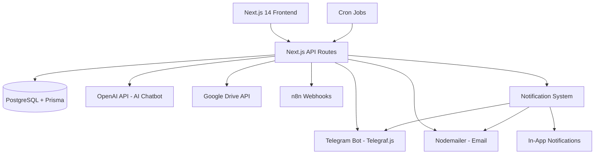

# Business Management Platform — Branding Studio

A comprehensive web platform to manage all business operations for a branding studio, with role-based access, multi-channel data entry (web forms + Telegram bot), an AI-powered internal chatbot, automated reporting, notifications, and n8n integration.

---

## Architecture Overview



**Tech Stack:**
| Layer | Technology |
|---|---|
| Frontend | Next.js 14 (App Router), TypeScript, Tailwind CSS |
| Charts/Dashboards | Recharts + shadcn/ui |
| Backend | Next.js API Routes |
| Database | PostgreSQL + Prisma ORM |
| Auth & Roles | NextAuth.js + RBAC middleware |
| AI Chatbot | OpenAI GPT-4o API |
| Telegram Bot | Telegraf.js |
| Email | Nodemailer + SendGrid |
| Google Drive | Google Drive API v3 |
| Automation | node-cron + n8n webhooks |
| Deployment | Docker Compose |

---

## Proposed Changes

### 1. Role-Based Access Control (RBAC)

#### Roles & Permissions

| Role | Access |
|---|---|
| **Gerencia** | Full access to all modules, reports, users, settings |
| **Contabilidad** | Accounting + Finance modules only |
| **Finanzas** | Finance + Reports |
| **Proyectos** | Project Management module |
| **Marketing** | Marketing module |
| **Comercial** | Commercial module (clients, leads, proposals) |

#### [NEW] `lib/rbac.ts`
- Permission map per role
- `withPermission(role, resource)` middleware for API routes
- Frontend route guards using NextAuth session

#### [NEW] `prisma/schema.prisma` — `User` model
```prisma
model User {
  id        String   @id @default(cuid())
  name      String
  email     String   @unique
  password  String
  role      Role     @default(COMERCIAL)
  telegramId String? @unique
  createdAt DateTime @default(now())
}

enum Role {
  GERENCIA
  CONTABILIDAD
  FINANZAS
  PROYECTOS
  MARKETING
  COMERCIAL
}
```

---

### 2. Notification System

Multi-channel notifications triggered by platform events (new project, task deadline, report ready, new lead, etc.).

#### [NEW] `lib/notifications.ts`
- `sendNotification(userId, event, payload)` — unified notification dispatcher
- Checks user preferences (in-app / Telegram / email)
- Queues notifications in DB for in-app display

#### [NEW] `prisma/schema.prisma` — `Notification` model
```prisma
model Notification {
  id        String   @id @default(cuid())
  userId    String
  type      String   // 'task_due', 'report_ready', 'new_lead', etc.
  message   String
  read      Boolean  @default(false)
  channel   String[] // ['in_app', 'telegram', 'email']
  createdAt DateTime @default(now())
  user      User     @relation(fields: [userId], references: [id])
}
```

#### Notification Events
| Event | Channels | Roles Notified |
|---|---|---|
| New project created | In-app + Telegram | Gerencia + Proyectos |
| Task due in 24h | In-app + Email | Assigned user |
| New lead added | In-app + Telegram | Gerencia + Comercial |
| Report generated | Email + In-app | Gerencia + requester |
| Invoice overdue | Email + Telegram | Gerencia + Contabilidad |
| Budget threshold exceeded | In-app + Email | Gerencia + Finanzas |

#### [NEW] `components/notifications/NotificationBell.tsx`
- Bell icon in header with unread count badge
- Dropdown panel with notification list
- Mark as read / mark all as read

#### [NEW] `app/api/notifications/` 
- `GET /api/notifications` — fetch user's notifications
- `PATCH /api/notifications/[id]/read` — mark as read

---

### 3. n8n Integration

#### [NEW] `lib/n8n.ts`
- `triggerN8nWebhook(workflowId, payload)` — sends POST to n8n webhook URL
- Configurable via `N8N_WEBHOOK_BASE_URL` env variable

#### [NEW] `app/api/webhooks/n8n/` 
- `POST /api/webhooks/n8n/inbound` — receives triggers from n8n workflows
- Validates webhook secret, routes to appropriate handler

#### [NEW] `app/configuracion/integraciones/page.tsx`
- UI to configure n8n webhook URLs per automation type
- Test webhook button
- Log of recent webhook calls

#### Example n8n Automation Flows (configured in n8n, triggered by platform):
- **New client added** → n8n → Create folder in Google Drive + send welcome email
- **Project completed** → n8n → Generate invoice draft + notify client
- **Monthly report ready** → n8n → Upload to Drive + send to stakeholders
- **New lead from email** → n8n → Parse email → POST to `/api/leads`

---

### 4. Updated Database Schema

#### [NEW] `prisma/schema.prisma` — Full schema
Models: `User`, `Transaction`, `Invoice`, `Budget`, `Project`, `Task`, `Campaign`, `Lead`, `Client`, `Proposal`, `Report`, `ChatMessage`, `Notification`, `WebhookLog`, `UserNotificationPreference`

---

### 5. Frontend — All Modules

#### [NEW] `app/dashboard/page.tsx`
- KPI cards: revenue, active projects, open leads, campaign ROI
- Charts: monthly revenue trend, project status, lead funnel
- Recent notifications panel
- Quick-action buttons

#### [NEW] `app/contabilidad/page.tsx` *(Contabilidad + Gerencia only)*
- Transaction list + add form
- Invoice management

#### [NEW] `app/finanzas/page.tsx` *(Finanzas + Gerencia only)*
- Budget vs. actual, cash flow, P&L

#### [NEW] `app/proyectos/page.tsx` *(Proyectos + Gerencia)*
- Kanban board, task list, Gantt timeline

#### [NEW] `app/marketing/page.tsx` *(Marketing + Gerencia)*
- Campaign cards, lead source charts

#### [NEW] `app/comercial/page.tsx` *(Comercial + Gerencia)*
- Sales pipeline Kanban, client directory, proposals

#### [NEW] `app/reportes/page.tsx` *(Gerencia + Finanzas)*
- Report generator, history, download

#### [NEW] `app/chatbot/page.tsx` *(All roles)*
- AI chat interface, context-aware

#### [NEW] `app/configuracion/page.tsx` *(Gerencia only)*
- User management (create/edit/delete users, assign roles)
- Notification preferences per user
- n8n integration settings
- Telegram bot settings

---

## User Review Required

> [!IMPORTANT]
> **API Keys & Credentials Needed** (can be added later via `.env.local`):
> - OpenAI API key
> - Telegram Bot Token (from @BotFather)
> - Google Drive OAuth2 credentials
> - SendGrid API key or SMTP credentials
> - n8n instance URL + webhook secret
> - PostgreSQL connection string

> [!NOTE]
> **Phased Delivery Recommendation:**
> - **Phase 1** *(this session)*: Full frontend — all modules, dashboards, RBAC UI, notification bell, n8n config UI — with mock/demo data
> - **Phase 2**: Backend API + PostgreSQL + real data persistence + RBAC enforcement
> - **Phase 3**: Telegram bot + Google Drive + Email + n8n webhooks + cron automations
>
> **¿Arrancamos con la Fase 1 completa o prefieres el stack completo desde el inicio?**

---

## Verification Plan

### Build Checks
- `npm run build` — no TypeScript errors
- `npm run lint` — code quality

### Browser Verification
- Login as **Gerencia** → verify access to all modules
- Login as **Contabilidad** → verify only Contabilidad/Finanzas visible
- Verify notification bell shows unread count
- Verify all dashboards render charts correctly
- Verify forms validate and submit
- Verify AI chatbot responds
- Verify n8n config page loads

### Manual Verification
1. `npm run dev` → open `http://localhost:3000`
2. Test each role's restricted navigation
3. Trigger a notification event and verify bell updates
4. Add a transaction, project, lead via forms
5. Generate a report
